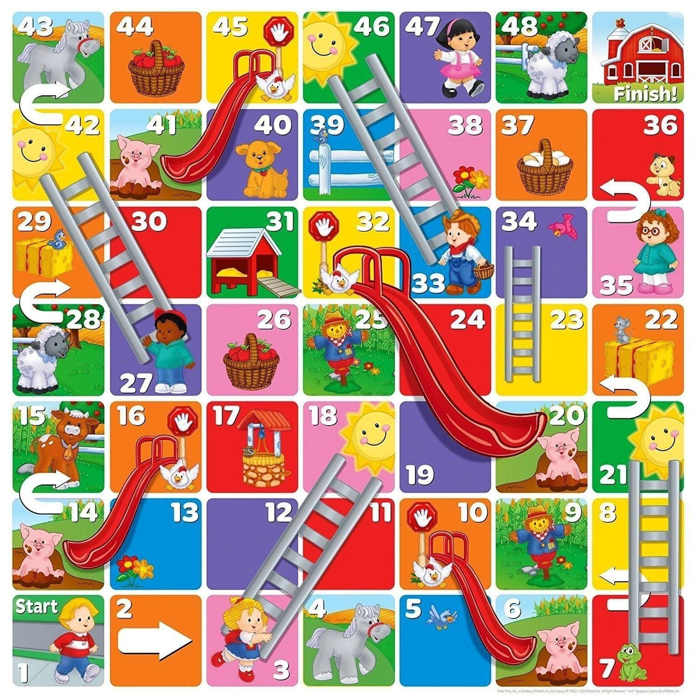

This project is explaining the concept of Monte Carlo Markov Chains with the Metropolis algorithm in a simulation. Used by me in teaching machine learning.

The follow-up exercise then is to program a chutes-and-ladders simulation based on this board:

Additional rules:

-   if ending up on a special field like #7 or #10, record the final destiny 21 or 6

-   to finish on #49, you need the correct number of steps, so starting at #48, only a roll of 1 brings you there. Otherwise, stay put and add this as another visit to #48

Expected results:

-   number of steps to finish a game, taken from e.g. 1000 replications

-   number of visits to each field, again counted over 1000 games

-   graphical representations of those numbers

-   challenge: visualize the movements from a single game, preferably over some grid-like structure resembling the board (or the actual picture of the board)
